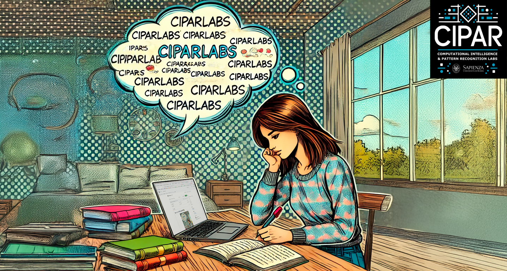

# Welcome to CIPAR Labs NLP 👋

  

CIPAR Labs NLP is your hub for innovative projects and research in Natural Language Processing (NLP), Neural Networks and Large Language Models. Our mission is to explore, develop, and share tools and methodologies to analyze, understand, and generate human language.

---

## 🔍 **Main Projects**

### 📘 **1. Text Classification**
Projects focused on automatic text classification, such as:
- **Sentiment Analysis**: Understanding emotions in texts.
- **Topic Modeling**: Identifying key topics in documents.

### 🗣️ **2. Language Generation**
Projects exploring natural language generation techniques:
- **Chatbots**: Implementing neural network-based dialog systems (LLMs).
- **Text Summarization**: Automatic summary generation.
- **Retrieval Augmented Generation**: Advanced RAG chatbots

### 🌍 **3. Structural Language Analysis**
Research aimed at processing texts with structural analysis:
- **Morphology, Syntax, Grammar**: Text characterization by suitable structural indexes.
- **Content and Complexity**: Content analysis through text embedding, Mutlitfractal and Recurrent Quantification Analysis.

### 📊 **4. Datasets and Benchmarks**
Creating and sharing annotated datasets for specific purposes:
- Classification datasets.
- Benchmarks to evaluate NLP models.
- Benchmarks to evaluate LLM texts.

---

## 📸 **How to Contribute**
We welcome you to explore our repository and contribute to improving our projects. Here’s how you can get started:
1. Fork the repository.
2. Propose changes or add new features.
3. Submit a pull request: every contribution is greatly appreciated!

---

## 📬 **Contact Us**
For more information, feel free to reach out:
- **Email**: [ciparlab@gmail.com.com](mailto:ciparlab@gmail.com)
- **Website**: [CIPAR Labs Official](https://sites.google.com/uniroma1.it/cipar-labs/)
- **LinkedIn**: [CIPAR Labs](https://www.linkedin.com/company/ciparlabs/)
- **GitHub companion**: [GitHub CIPAR-Labs](https://github.com/CIPARLAB)
---

Thank you for visiting our repository! 🎉
